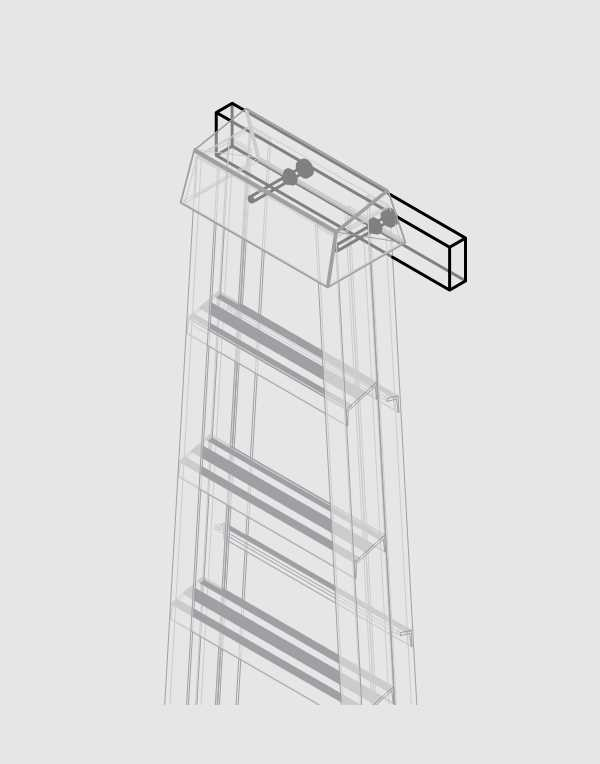

# Ladder Rack

Dangerously simple ladder rack. Quick to build, quick to mount. Threads on the bolt grip the tops or rungs to prevent it from sliding off without making it hard to hang heavy ladders.

The spacing between the bolts can be adjusted multiple sizes of ladder. We've found that two Tapcon screws into block wall is more than adequate to hang ladders up to 12'. We added an additional Tapcon for our taller ladders.

## Materials
* 22" 2x4

## Hardware
* (2) 3/8" x 5" Hex Bolts

## PDF
* Construction Drawings [LadderRack.pdf](LadderRack.pdf)

## 3D
* Full 3D View [LadderRack.stl](LadderRack.stl)
