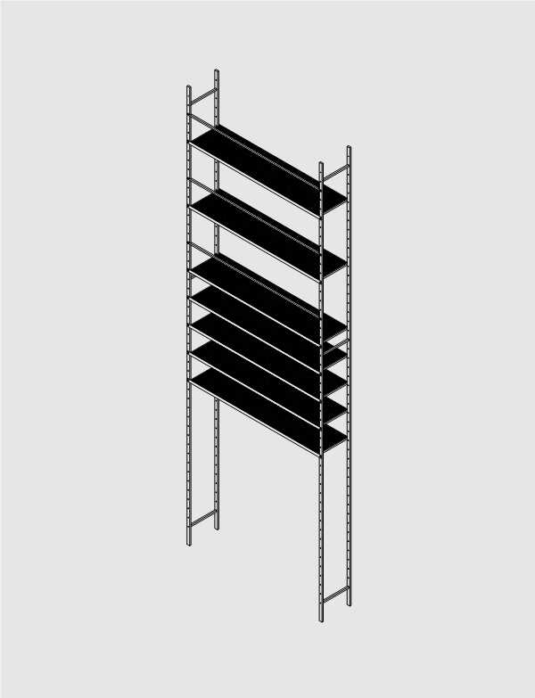

# Tall Shelves

Designed to be modular and fairly inexpensive. 3/8 holes spaced every 6" along the vertical posts provide options for adjustability and make it simple to bolt on more shelves or other accessories. Open slots for bolt holes make assembly easy even if the posts are slighly out of plumb or the bolt holes are slightly off center.

We designed ours to have 8' of open space below it for future use. Ours is also 25' tall, because we were able to bolt it securely between structural concrete columns. Bolting to building structure is recommended.

## Materials
* 1x2 Box Steel
* 1x1 Box Steel
* 1/8 x 2 Flat Steel Bar
* Expanded Steel

## Hardware
* 3/8" x 2" Hex Bolts

(Materials and hardware will very depending on the specifc dimension and number of shelves)

## PDF
* Construction Drawings [TallShelves.pdf](TallShelves.pdf)

## 3D
* Full 3D View [TallShelves.stl](TallShelves.stl)
* Single Shelf [SingleShelf.stl](SingleShelf.stl)
* Single Safety Bar [SingleSafetyBar.stl](SingleSafetyBar.stl)
